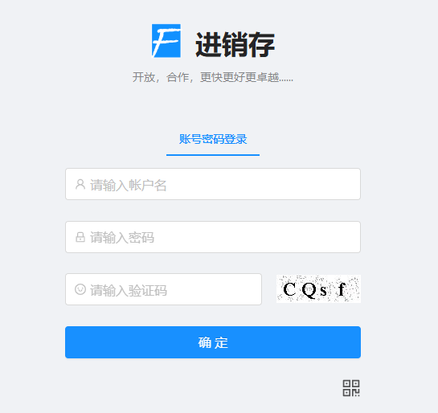
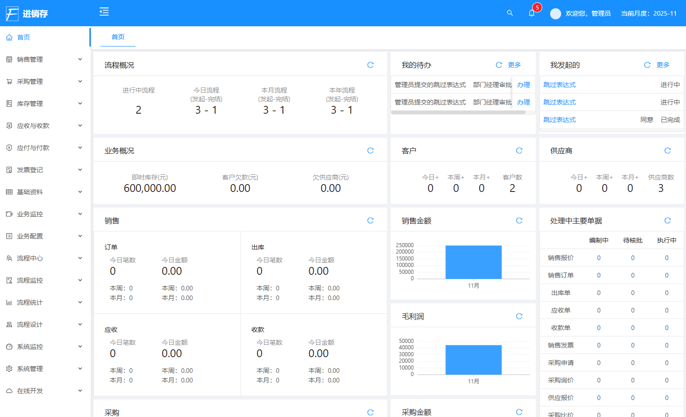
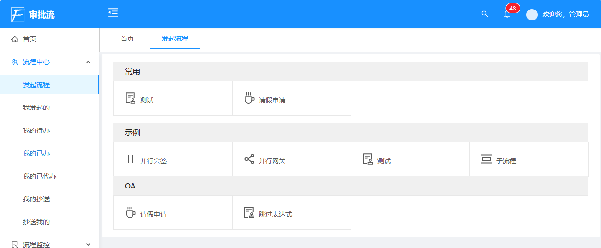
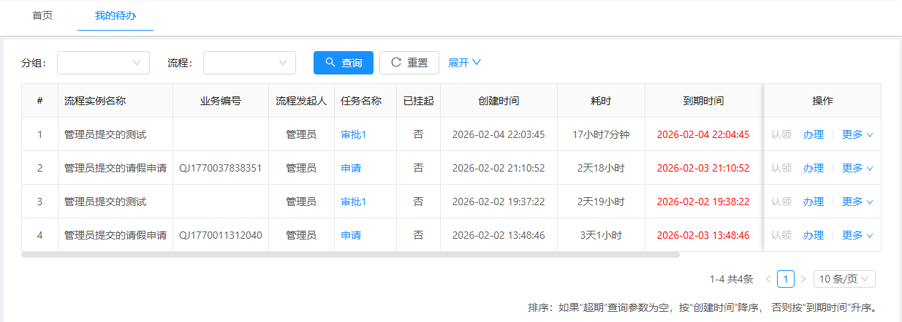
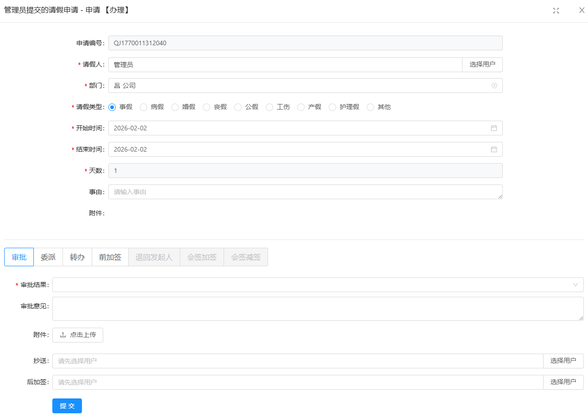
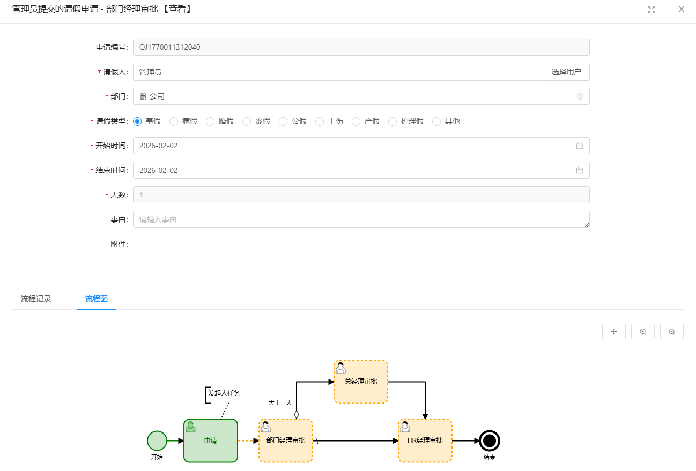
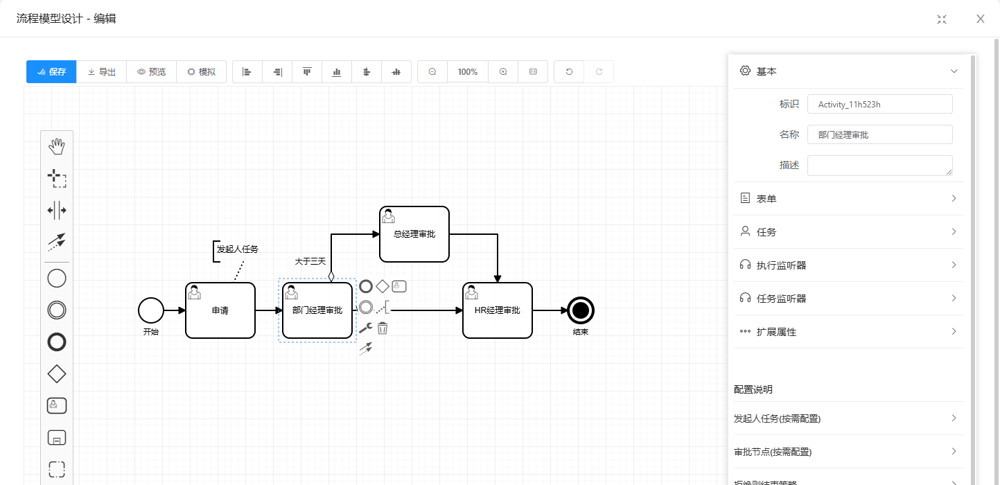
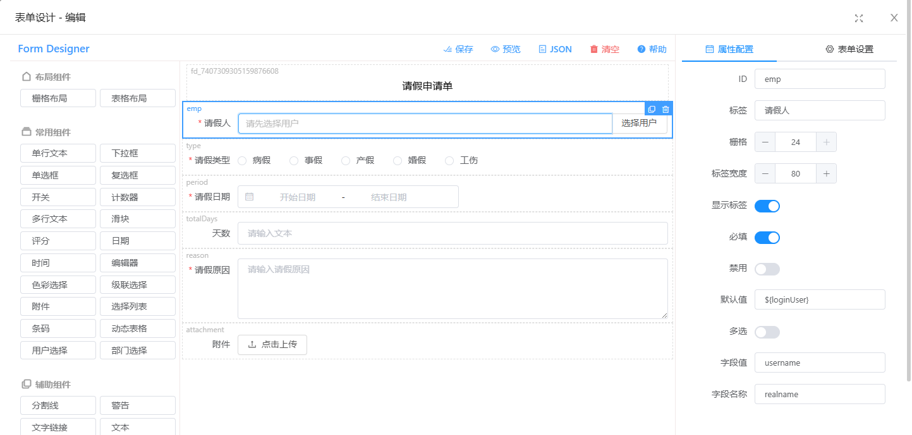

Finer 进销存系统
===============

[]()
[]()
[]()

介绍
-----------------------------------
Finer 进销存系统是一款面向中小企业的管理软件，基于二十多年的中小企业管理经验，由ERP领域的资深专家分析设计；
以jeecgboot(Vue2)为基础平台开发，前后端分离架构SpringBoot2.x、Ant Design&Vue、Mybatis-plus、Shiro、JWT；
具有方便快捷的定制和二次开发能力，在jeecgboot支撑下，利用其强大的代码生成器，无需写任何代码就可以快速实现大多功能，
也可手工加入复杂的业务逻辑，快速满足中小企业灵活多样的个性化需求！

 - 社区版：实现进销存业务的结果管理，直接出入库并自动生成应收应付，进行收付款并自动核销应收应付。
   社区版不包括采购管理、销售管理、扫码出入库、安卓App，详看后面的功能模块说明。  
   
 - 标准版：实现进销存业务的全过程管理，包括申请、询价、报价、比价、订单、出入库、生产出入库、应收应付、收付款、发票登记等的业务全过程，
   自动跟踪单据的处理情况，实时反映库存、客户欠款和欠供应商款等情况，集成钉钉等第三方审批系统；
   支持扫码出入库和库存盘点，在PC浏览器中可接扫描枪扫码，在手机App中可使用相机扫码。  
   
 - 审批流版：在标准版的基础上，内置了审批流功能，提供从‌流程设计、流程执行、流程监控、数据分析到业务集成‌的全方位能力，
   可与OA、ERP、CRM、MES等业务系统无缝集成。
 
交流与支持
-----------------------------------
- 微信： cfm999-qq-com
- 邮件： cfm999@qq.com 

演示系统
-----------------------------------
http://117.72.79.154
- 用户名：psi
- 密　码：123456
- 浏览器：Chrome、Edge、Firefox、360浏览器，不建议IE
- 说　明：
  - 手机App：在PC端“登录页面”右下角，使用手机浏览器扫码下载。
  - 演示用户未开放部分在线开发和系统管理功能，如需要全功能或比较独立的环境，请联系我们。
  - 为方便正常演示，请不要：删除已有的或他人的数据、修改演示用户密码等影响演示的数据。
  - 有问题可微信或邮件联系我们。


功能模块
-----------------------------------
```
┌─App（商业版，目前仅支持安卓）
│
├─销售管理（商业版）
│  ├─销售报价
│  ├─销售订单
│  └─销售统计
│     ├─销售订单执行情况
│     ├─销售订单毛利润
│     ├─销售订单毛利润明细
│     ├─销售订单汇总
│     ├─销售订单汇总-部门
│     ├─销售订单汇总-业务员
│     ├─销售订单汇总-客户
│     └─销售订单汇总-物料
├─采购管理（商业版）
│  ├─采购申请
│  ├─采购询价
│  ├─采购报价
│  ├─采购比价
│  ├─采购订单
│  └─采购统计
│     ├─采购订单执行情况
│     ├─采购订单汇总
│     ├─采购订单汇总-部门
│     ├─采购订单汇总-业务员
│     ├─采购订单汇总-供应商
│     └─采购订单汇总-物料
├─库存管理（（商业版可以扫码出入库和盘点）
│  ├─生产管理（商业版）
│  │  ├─生产领料
│  │  ├─生产退料
│  │  ├─产品入库
│  │  ├─产品组装
│  │  └─产品拆卸
│  ├─入库管理
│  │  ├─采购入库：自动生成采购应付
│  │  ├─采购退货出库：自动生成红字采购应付
│  │  ├─盘盈入库
│  │  ├─涨吨入库
│  │  └─其他入库
│  ├─扫序列码入库（商业版）
│  │  ├─采购入库SN：自动生成采购应付
│  │  ├─采购退货出库SN：自动生成红字采购应付
│  │  ├─盘盈入库SN
│  │  └─其他入库SN
│  ├─出库管理
│  │  ├─销售出库：自动生成销售应收
│  │  ├─销售退货入库：自动生成红字销售应收
│  │  ├─盘亏出库
│  │  └─其他出库
│  ├─扫序列码出库（商业版）
│  │  ├─销售出库SN：自动生成销售应收
│  │  ├─销售退货入库SN：自动生成红字销售应收
│  │  ├─盘亏出库SN
│  │  └─其他出库SN
│  ├─其他管理
│  │  ├─库存调拨
│  │  ├─成本调整
│  │  └─库存盘点
│  ├─扫序列码其他（商业版）
│  │  ├─库存调拨SN
│  │  ├─成本调整SN
│  │  └─库存盘点SN
│  ├─即时库存
│  │  ├─物料库存
│  │  ├─物料批次库存
│  │  ├─出库物料库存
│  │  ├─详细库存
│  │  └─个体库存（商业版）
│  └─出入库统计
│     ├─出入库月汇总
│     ├─出入库日汇总
│     ├─出入库明细
│     └─个体出入库明细（商业版）
├─应收与收款 
│  ├─应收管理
│  │  ├─销售应收
│  │  ├─其他应收
│  │  └─应收核销
│  ├─预收管理
│  │  ├─销售预收
│  │  └─其他预收
│  ├─收款管理
│  │  ├─销售收款：自动生成应收核销
│  │  ├─销售退货退款申请
│  │  ├─销售退货退款(有申请)：自动生成应收核销
│  │  ├─销售退货退款(无申请)：自动生成应收核销
│  │  └─其他收款
│  └─应收统计
│     ├─应收对账
│     ├─应收明细
│     ├─应收月汇总
│     └─应收即时余额
├─应付与付款 
│  ├─应付管理
│  │  ├─采购应付
│  │  ├─其他应付
│  │  └─应付核销
│  ├─预付管理
│  │  ├─采购预付申请
│  │  ├─采购预付
│  │  ├─采购预付(无申请)
│  │  ├─其他预付申请
│  │  ├─其他预付
│  │  └─其他预付(无申请)
│  ├─付款管理
│  │  ├─采购付款申请
│  │  ├─采购付款：自动生成应付核销
│  │  ├─采购付款(无申请)：自动生成应付核销
│  │  ├─采购退货退款：自动生成应付核销
│  │  ├─其他付款申请
│  │  ├─其他付款
│  │  └─其他付款(无申请)
│  └─应付统计
│     ├─应付对账
│     ├─应付明细
│     ├─应付月汇总
│     └─应付即时余额
├─发票登记
│  ├─销售发票
│  ├─销售发票(红冲)
│  ├─销售发票(退货)
│  ├─采购发票
│  ├─采购发票(红冲)
│  └─采购发票(退货)
├─基础资料 
│  ├─客户、供应商
│  ├─仓库、物料分类、物料、计量单位
│  ├─BOM（商业版）
│  ├─银行账户、币种
│  └─审批定义
├─业务配置 
│  ├─单据选项：单据可设置为需审核、审批、不核批
│  ├─审批定义
│  └─起用月度
├─业务监控 
│  ├─审批信息
│  └─月度结账
│
├─流程中心
│  ├─发起流程
│  ├─我发起的
│  ├─我的待办
│  ├─我的已办
│  ├─我的已代办
│  ├─我的抄送
│  ├─抄送我的
│  └─我的代办
├─流程监控
│  ├─流程定义
│  ├─进行中流程
│  ├─已完结流程
│  ├─待办任务
│  ├─已办任务
│  ├─超期已办
│  ├─催办信息
│  └─抄送信息
├─流程统计
│  ├─流程分组统计
│  ├─流程按月统计
│  ├─流程审批结果分组统计
│  ├─任务平均耗时按人统计
│  └─超期任务按月统计
├─流程设计
│  ├─流程模型
│  ├─预置表达式
│  ├─内置扩展属性
│  ├─内置流程变量
│  └─设计器表单
│
├─系统监控（JeecgBoot功能）
│  ├─在线用户
│  ├─定时任务
│  ├─系统日志
│  ├─数据日志（记录数据快照，可对比快照，查看数据变更情况）
│  ├─性能扫描监控
│  │  ├─监控 Redis
│  │  ├─Tomcat
│  │  ├─jvm
│  │  ├─服务器信息
│  │  ├─请求追踪
│  │  └─磁盘监控
│  ├─SQL监控
│  └─在线接口文档(swagger)
├─系统管理（JeecgBoot功能）
│  ├─系统通告
│  ├─数据字典
│  ├─分类字典
│  ├─菜单管理
│  │ └─权限设置（支持按钮权限、数据权限）
│  ├─用户管理
│  ├─角色管理
│  ├─部门管理
│  ├─职务管理
│  └─通讯录
├─消息中心（JeecgBoot功能）
│  ├─消息管理
│  ├─模板管理
│  └─我的消息
└─在线开发（JeecgBoot功能）
   ├─Online在线表单 - 功能已开放
   │  └─Online代码生成器 - 功能已开放
   ├─Online在线报表 - 功能已开放
   ├─积木报表设计 - 功能已开放
   │   ├─打印设计器
   │   ├─数据报表设计
   │   └─图形报表设计（支持echart）
   ├─Online在线报表 - 功能已开放
   ├─系统编码生成规则 - 功能已开放
   ├─系统编码校验规则 - 功能已开放
   ├─多数据源管理 - 功能已开放
   └─DEMO
```
   
系统效果
-------
#### 登录

#### 首页

#### 采购订单

### 采购订单 - 编制和自定义列

#### 采购订单 - 源单

### 销售订单 - 执行情况

#### 销售订单 - 毛利润

#### 销售业务员业绩

#### 单据审批 - 手机钉钉

#### 单据打印


#### 发起流程

#### 我的待办

#### 审批

#### 流程图

#### 在线流程模型设计

#### 在线表单设计

   
技术架构
-----------------------------------
#### 开发环境
- 语言：Java 8
- IDE(JAVA)： IDEA (必须安装lombok插件 )
- IDE(前端)： Vscode、WebStorm、IDEA
- 依赖管理：Maven
- 缓存：Redis
- 数据库脚本：MySQL5.7

#### 后端
- 基础框架：Spring Boot 2.6.6
- 微服务框架： Spring Cloud Alibaba 2021.0.1.0
- 持久层框架：MybatisPlus 3.5.1
- 报表工具： JimuReport 1.6.6
- 安全框架：Apache Shiro 1.8.0，Jwt 3.11.0
- 微服务技术栈：Spring Cloud Alibaba、Nacos、Gateway、Sentinel、Skywalking
- 数据库连接池：阿里巴巴Druid 1.1.22
- 日志打印：logback
- 其他：autopoi, fastjson，poi，Swagger-ui，quartz, lombok（简化代码）等。

#### 前端
- 基础框架：[ant-design-vue](https://github.com/vueComponent/ant-design-vue) - Ant Design Of Vue 实现
- JavaScript框架：Vue2
- node 12
- yarn
- @vue/cli 3.2.1
- [vue-cropper](https://github.com/xyxiao001/vue-cropper) - 头像裁剪组件
- [@antv/g2](https://antv.alipay.com/zh-cn/index.html) - Alipay AntV 数据可视化图表
- [Viser-vue](https://viserjs.github.io/docs.html#/viser/guide/installation)  - antv/g2 封装实现
- [Vue 2.6.10](https://cn.vuejs.org/),[Vuex](https://vuex.vuejs.org/zh/),[Vue Router](https://router.vuejs.org/zh/)
- [Axios](https://github.com/axios/axios)
- [webpack](https://www.webpackjs.com/),[yarn](https://yarnpkg.com/zh-Hans/)
- 
